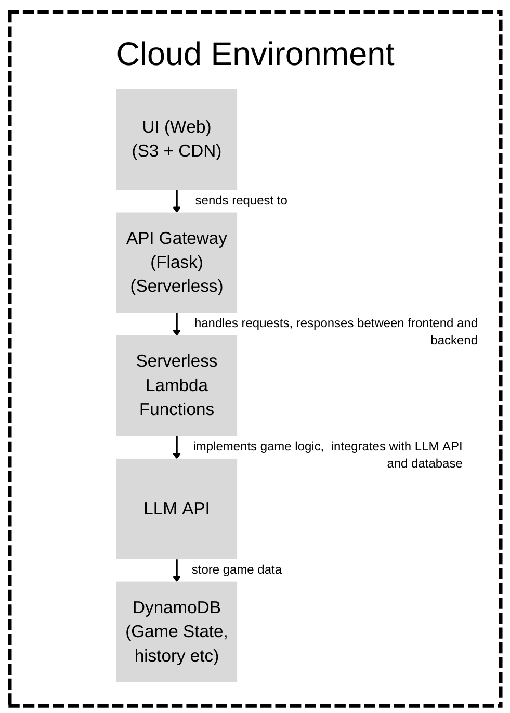

# The Akinator - 20Q version

## Overview
This project aims to create an application that plays the classic 20 Questions game using a state-of-the-art AI model to guess the answer. The user thinks of an object, and the AI asks up to 20 yes/no questions to determine the answer.

## Architecture Diagram



## Discussion
### a. Component Interaction

1. User Interface : 
    - Using s3 and CDN reduces latency and reduces hosting costs for the frontend.
    - The UI communicates with the backend through HTTP requests.

2. API Gateway : 
    - Secure and simplified approach to connect frontend and backend.
    - API Gateway routes incoming requests from the UI to AWS Lambda.

3. Lambda Functions :
    - Processes both question generation and user answers. 
    - Interacts with DynamoDB for managing game states and communicates with the Language Model Proxy for generating questions.
    - no need for server management

4. LLM API :
    - Interacts with the external Language Model API.
    - Since its an external API, all exceptions are handled automatically.

5. DynamoDB :
    - The backend interacts with DynamoDB to read and update game states.
    - A serverless and scalable solution. Quick and efficient access to data.


One alternate option was to chose a pre-trained model (something like akinator) rather than relying on a plain conversational model approach. But this would increase the model hosting cost. Also, with game data, we could generate better responses based on the behaviours of users. This requires alot of data.


### b. Model and Component Selection
1. Language Model Choice (GPT-3.5 Turbo) :     
    
    ```
    GPT-3.5 Turbo is a powerful and versatile language model developed by OpenAI. It excels at natural language understanding and generation, making it suitable for a conversational game like 20 Questions.
    
    GPT-3.5 Turbo is capable of generating contextually relevant responses, which is crucial for an interactive guessing game.
    ```

2. Flask as the Web Framework :
    ```
    Flask is a lightweight and flexible web framework for Python.

    For a relatively simple web application like the 20 Questions game, Flask provides the necessary functionality without unnecessary complexity.
    ```

3. AWS Lambda for Serverless Execution :
    ```
    AWS Lambda enables serverless execution, allowing the application to scale automatically based on demand.

    For a game with potential variations in user load, serverless architecture ensures cost-effectiveness and efficient resource utilization.
    ```

4. API Gateway for Endpoint Management:
    ```
    AWS API Gateway serves as the entry point for external requests, routing them to the appropriate Lambda functions.

    It provides a simple way to manage API endpoints, secure communication, and integrate with serverless functions.
    
    API Gateway facilitates the creation of a well-defined API for interaction with the game.
    ```

5. Amazon S3 for Hosting UI Assets:
    ```
    Amazon S3 is an ideal solution for hosting static assets of the UI, including HTML, CSS, and JavaScript files.

    It offers scalability, cost-effectiveness, and durability.
    ```
    
6. Content Delivery Network (CDN) for Improved User Experience:
    ```
    Introducing a CDN enhances the performance of the web application by reducing latency and improving content delivery.

    CDNs cache static assets at edge locations, ensuring faster load times for users globally.

    Improved user experience is crucial for the success of the game.
    ```

### c. Deployment Steps

1. Environment Configuration:
    ```
    Utilize environment variables to store sensitive information such as API keys.
    ```

2. Serverless Deployment with AWS Lambda and API Gateway:
    ```
    Deploy the Flask application as a serverless function using AWS Lambda.
    
    Utilize AWS API Gateway to create and manage API endpoints, routing requests to the Lambda function.
    ```
3. Static Assets Hosting on Amazon S3:
    ```
    Host static assets (HTML, CSS, JavaScript) of the UI on Amazon S3.

    Configure S3 bucket for static website hosting.
    ```

4. CDN Integration for Improved User Experience:
    ```
    Integrate a Content Delivery Network (CDN) to cache and deliver static assets globally.
    ```

5. Testing and exception handling :
    ```
    Test the application to identify bugs or unwanted responses.
    ```

## Code and Running Instructions

### Prerequisites:
- Python 3.x
- LLM API Key

### Steps:
1. Clone Repository:

```
git clone https://github.com/Abhijith14/The-Akinator-20Q-Version.git
cd The-Akinator-20Q-Version
```

2. Install Dependencies:

```
pip install -r requirements.txt
```

3. Configuration:
    - Modify config.py to include your API key.

4. Run Locally:

```
python app.py
```

Access the UI at http://localhost:5000.

